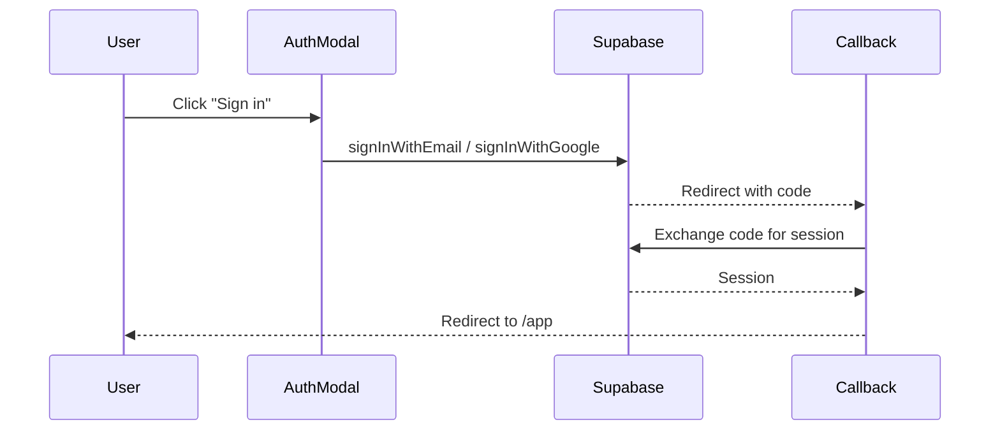
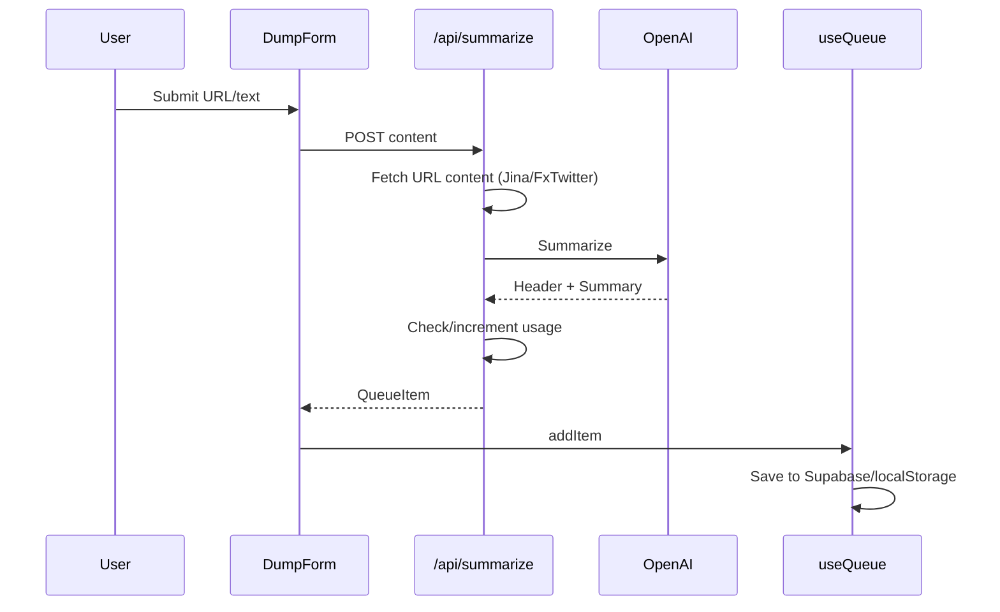
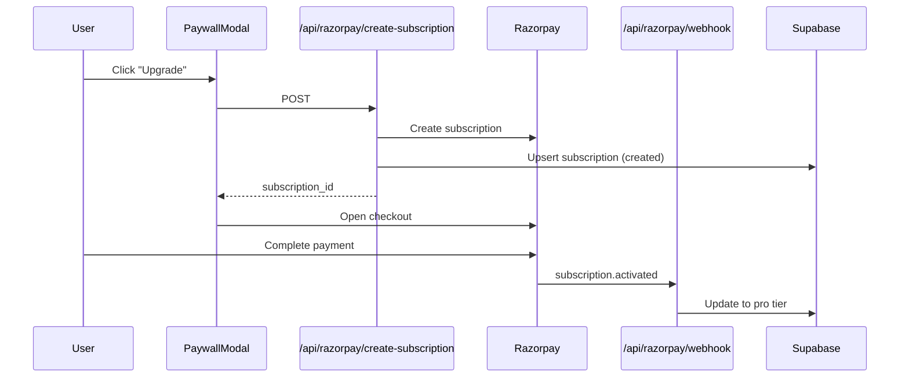

# Codebase Map: Focus First

> Auto-generated by Cartographer. Last mapped: 2026-01-17

## System Overview

A Next.js learning application that helps users process AI/ML news and links one item at a time. Features AI-powered summarization, curriculum optimization, and a freemium subscription model with Razorpay payments and Supabase backend.

```mermaid
graph TB
    subgraph Client
        Web[Next.js App]
        Auth[AuthContext]
        Queue[useQueue Hook]
        Archive[useArchive Hook]
        Sub[useSubscription Hook]
    end

    subgraph "API Routes"
        Summarize[/api/summarize]
        Architect[/api/architect]
        RazorpayCreate[/api/razorpay/create-subscription]
        RazorpayWebhook[/api/razorpay/webhook]
        SubStatus[/api/subscription/status]
    end

    subgraph External
        OpenAI[OpenAI GPT-4o-mini]
        Jina[Jina.ai Reader]
        FxTwitter[FxTwitter API]
        Razorpay[Razorpay]
    end

    subgraph Data
        Supabase[(Supabase)]
        LocalStorage[(localStorage)]
    end

    Web --> Auth
    Web --> Queue
    Web --> Archive
    Web --> Sub

    Auth --> Supabase
    Queue --> Supabase
    Queue --> LocalStorage
    Archive --> Supabase
    Archive --> LocalStorage
    Sub --> SubStatus

    Web --> Summarize
    Web --> Architect
    Web --> RazorpayCreate

    Summarize --> OpenAI
    Summarize --> Jina
    Summarize --> FxTwitter
    Architect --> OpenAI
    RazorpayCreate --> Razorpay
    RazorpayWebhook --> Supabase
    Razorpay --> RazorpayWebhook
```

## Directory Structure

```
focused-information/
├── app/                          # Next.js App Router
│   ├── api/                      # API routes
│   │   ├── architect/            # Curriculum optimization (GPT-4o-mini)
│   │   ├── razorpay/             # Payment endpoints
│   │   │   ├── create-subscription/
│   │   │   └── webhook/
│   │   ├── subscription/status/  # Usage and tier info
│   │   └── summarize/            # URL/text summarization
│   ├── app/                      # Main application page
│   ├── auth/callback/            # OAuth callback handler
│   ├── globals.css               # Global styles
│   ├── layout.tsx                # Root layout with AuthProvider
│   └── page.tsx                  # Landing page (blank)
├── components/                   # React components
│   ├── ArchitectReasoning.tsx    # Shows AI analysis reasoning
│   ├── ArchiveDrawer.tsx         # Learned items drawer
│   ├── AuthModal.tsx             # Sign in/up modal
│   ├── DumpForm.tsx              # URL/text input form
│   ├── FocusCard.tsx             # Current learning item display
│   ├── PaywallModal.tsx          # Pro upgrade modal
│   ├── ShareModal.tsx            # Twitter/X sharing modal
│   └── UsageBadge.tsx            # Tier/usage indicator
├── context/                      # React contexts
│   └── AuthContext.tsx           # Global auth state
├── hooks/                        # Custom React hooks
│   ├── useArchive.ts             # Archive state management
│   ├── useQueue.ts               # Queue state management
│   └── useSubscription.ts        # Subscription status
├── lib/                          # Shared utilities
│   ├── razorpay/
│   │   ├── client.ts             # Browser SDK loader
│   │   └── server.ts             # Server instance + tier config
│   ├── supabase/
│   │   ├── client.ts             # Browser client
│   │   ├── middleware.ts         # Session refresh
│   │   └── server.ts             # Server client
│   ├── routes.ts                 # Route constants
│   ├── share.ts                  # Twitter sharing logic
│   └── subscription.ts           # Usage enforcement
├── supabase/migrations/          # Database schema
├── types/                        # TypeScript definitions
│   └── index.ts
└── middleware.ts                 # Next.js middleware
```

## Module Guide

### API Routes (`app/api/`)

| File | Purpose | Key Dependencies |
|------|---------|------------------|
| `summarize/route.ts` | Transform URLs/text into learning cards | OpenAI, Jina.ai, FxTwitter |
| `architect/route.ts` | Curriculum optimization (Pro feature) | OpenAI |
| `razorpay/create-subscription/route.ts` | Create payment subscription | Razorpay SDK |
| `razorpay/webhook/route.ts` | Handle payment events | crypto, Supabase service role |
| `subscription/status/route.ts` | Get tier, usage, feature flags | lib/subscription |

### Components (`components/`)

| File | Purpose | Props |
|------|---------|-------|
| `DumpForm.tsx` | Collapsible URL/text input | onSubmit, isProcessing, isCollapsed |
| `FocusCard.tsx` | Display current learning item | item, onMarkLearned, onDelete |
| `ArchitectReasoning.tsx` | Show analysis status (auto-hide) | reasoning, isAnalyzing |
| `ArchiveDrawer.tsx` | Slide-in learned items drawer | isOpen, items, onRequeue |
| `AuthModal.tsx` | Email/Google sign in/up | isOpen, onClose |
| `ShareModal.tsx` | Twitter/X sharing with preview | shareData |
| `PaywallModal.tsx` | Pro upgrade with Razorpay | currentUsage, onSuccess |
| `UsageBadge.tsx` | Tier badge or usage counter | tier, used, limit |

### Hooks (`hooks/`)

| File | Purpose | Key Exports |
|------|---------|-------------|
| `useQueue.ts` | Queue with dual persistence | queue, addItem, removeItem, setQueue |
| `useArchive.ts` | Archive with dual persistence | archive, addToArchive, removeFromArchive |
| `useSubscription.ts` | Subscription status polling | tier, canSummarize, canUseArchitect, isPro |

### Libraries (`lib/`)

| File | Purpose |
|------|---------|
| `supabase/client.ts` | Browser-side Supabase client |
| `supabase/server.ts` | Server-side Supabase client (cookies) |
| `supabase/middleware.ts` | Session refresh middleware |
| `razorpay/client.ts` | Browser SDK loader + checkout |
| `razorpay/server.ts` | Server instance + TIER_LIMITS config |
| `subscription.ts` | Usage checking/incrementing, pro feature gates |
| `share.ts` | Tweet text generation |
| `routes.ts` | Route constants |

## Data Flow

### Authentication Flow



### Summarization Flow



### Payment Flow



## Key Patterns

### Dual Persistence
Queue and archive hooks use conditional storage based on auth state:
- **Anonymous**: localStorage (no sync)
- **Authenticated**: Supabase (cross-device sync)
- **Migration**: On first login, localStorage data migrates to Supabase

### Pro Feature Gating
- **Server-side**: `checkProFeature()` and `checkUsageLimit()` in lib/subscription.ts
- **Client-side**: `useSubscription` hook provides `canSummarize`, `canUseArchitect`, `isPro`
- **Response**: 403 with error code triggers paywall modal

### Debounced Architect Analysis
- 500ms debounce after queue changes
- Prevents API spam when adding multiple items
- Improves UX by batching rapid changes

### Webhook State Machine
Razorpay webhooks drive subscription status transitions:
- `subscription.authenticated` → Payment authorized
- `subscription.activated` → Upgrade to pro
- `subscription.cancelled` → Downgrade to free

## Database Schema

**Tables:**
- `user_subscriptions`: tier, status, razorpay_subscription_id, current_period_end
- `daily_usage`: user_id, date, summarizations_count, items_created_count

**Key Functions:**
- `handle_new_user_subscription()`: Auto-create free tier on signup
- `increment_usage()`: Atomic counter increment RPC

## Environment Variables

| Variable | Purpose |
|----------|---------|
| `NEXT_PUBLIC_SUPABASE_URL` | Supabase project URL |
| `NEXT_PUBLIC_SUPABASE_ANON_KEY` | Supabase anon key |
| `SUPABASE_SERVICE_ROLE_KEY` | Supabase service role (webhooks) |
| `OPENAI_API_KEY` | GPT-4o-mini access |
| `RAZORPAY_KEY_ID` | Razorpay API key |
| `RAZORPAY_KEY_SECRET` | Razorpay secret |
| `NEXT_PUBLIC_RAZORPAY_KEY_ID` | Razorpay public key |
| `RAZORPAY_PLAN_ID` | Pro subscription plan ID |
| `RAZORPAY_WEBHOOK_SECRET` | Webhook signature verification |

## Navigation Guide

**To add a new API endpoint:**
1. Create `app/api/[name]/route.ts`
2. Use `createClient()` from `lib/supabase/server.ts` for auth
3. Add usage checks if needed via `lib/subscription.ts`

**To add a new component:**
1. Create `components/[Name].tsx`
2. Import in `app/app/page.tsx` and wire up props
3. Add any required state/modals to page.tsx

**To modify auth:**
- Auth state: `context/AuthContext.tsx`
- OAuth callback: `app/auth/callback/route.ts`
- Session middleware: `lib/supabase/middleware.ts`

**To modify subscription/payments:**
- Tier limits: `lib/razorpay/server.ts` (TIER_LIMITS)
- Usage logic: `lib/subscription.ts`
- Payment UI: `components/PaywallModal.tsx`
- Webhooks: `app/api/razorpay/webhook/route.ts`

**To modify the queue:**
- State management: `hooks/useQueue.ts`
- Display: `components/FocusCard.tsx`
- Reordering: `app/api/architect/route.ts`

## Design Philosophy

1. **Focus-First**: One item at a time, no distractions
2. **Hype-Free**: Clinical, factual summaries without marketing speak
3. **Brutalist UI**: High contrast, monospace fonts, sharp shadows, cream paper
4. **Progressive Enhancement**: Works without auth, better with auth
5. **Freemium Model**: 3/day free tier, unlimited Pro with architect
